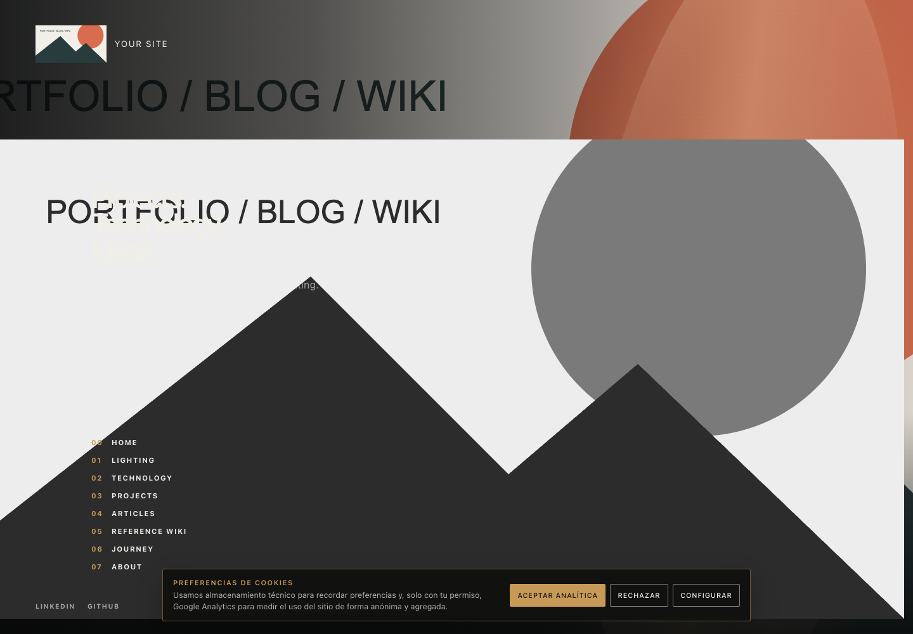
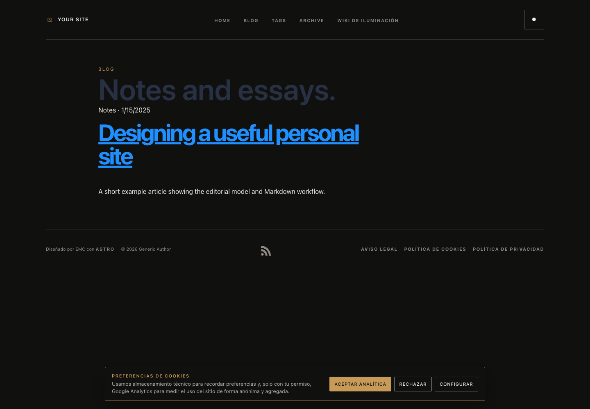
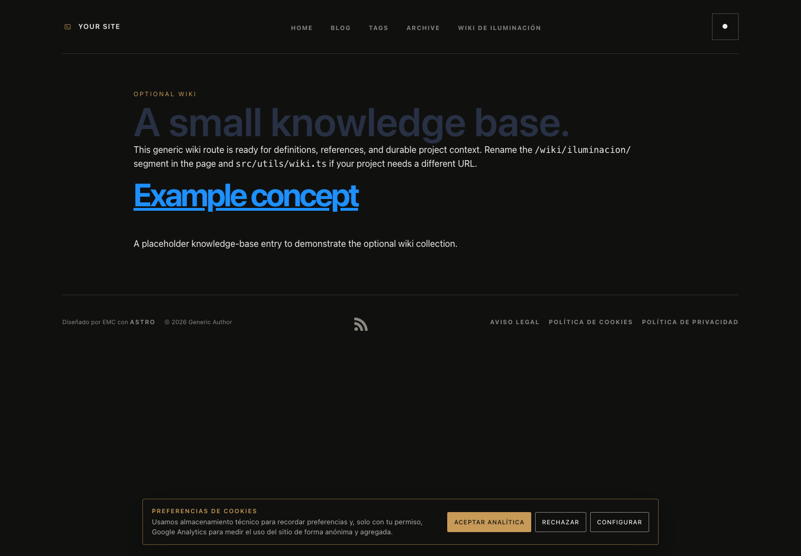

# Astro Portfolio + Blog + Wiki Template

A generic, buildable Astro starter for a portfolio, editorial blog, and optional knowledge wiki. It contains example content and placeholder assets only—replace them before publishing.

Created by [Eloy Martínez Cuesta](https://eloymartinezcuesta.com).

## Quick start

Requirements: Node.js `>=22.12.0` and npm.

```bash
npm install
npm run dev
npm run build
```

The local site runs at `http://localhost:4321`.

## Customization

1. Edit `src/config.ts` for the site name, URL, description, social links, SEO image, and homepage filters.
2. Replace `src/authors.js` with your author profiles.
3. Add Markdown or MDX posts under `src/content/blog/` and update the collection loader in `src/content.config.ts` if you want a different content pattern.
4. Add wiki entries under `src/content/wiki/iluminacion/`, or rename the collection and route for your subject area.
5. Replace the SVG placeholders in `public/` with your own optimized assets.
6. Update navigation and visual tokens in `src/components/` and `src/styles/`.

All URLs, names, social handles, analytics IDs, and legal text in this repository are examples. Search, RSS, sitemap, responsive navigation, SEO metadata, article layouts, tag/archive routes, and the wiki pattern are designed to be extended rather than treated as finished product copy.

## Project map

```text
src/
├── components/       # Navigation, search, SEO, cards, and shared UI
├── content/          # Blog and optional wiki Markdown collections
├── layouts/          # Site, home, interior, and article shells
├── pages/            # Portfolio, blog, tags, archive, API, and wiki routes
├── styles/           # Global and page-level styles
├── config.ts         # Site identity and reusable settings
└── content.config.ts # Content schemas and loaders
public/               # Curated generic SVG placeholders
astro.config.mjs      # Markdown, sitemap, and Tailwind integration
wrangler.toml         # Optional Cloudflare Pages settings
```

## Screenshots

The template includes representative captures of the generic example site:

| Home | Blog | Wiki |
| --- | --- | --- |
| [](docs/screenshots/home.png) | [](docs/screenshots/blog.png) | [](docs/screenshots/wiki.png) |

## Demo video

GitHub does not render a YouTube iframe inside a README. Upload `docs/demo.mp4` to a GitHub issue, discussion, or release, then replace the URL below with the generated asset URL:

```md
[](GITHUB_VIDEO_ASSET_URL)
```

The local demo is generated from the three captures. It is intentionally ignored by Git so the repository does not carry a binary video; GitHub hosts the uploaded asset instead.

## Deployment

Run `npm run build` and deploy the generated `dist/` directory to any static host, including Cloudflare Pages.

## License

MIT. Copyright © 2026 [Eloy Martínez Cuesta](https://eloymartinezcuesta.com). Replace the example identity, content, and links before redistribution.
